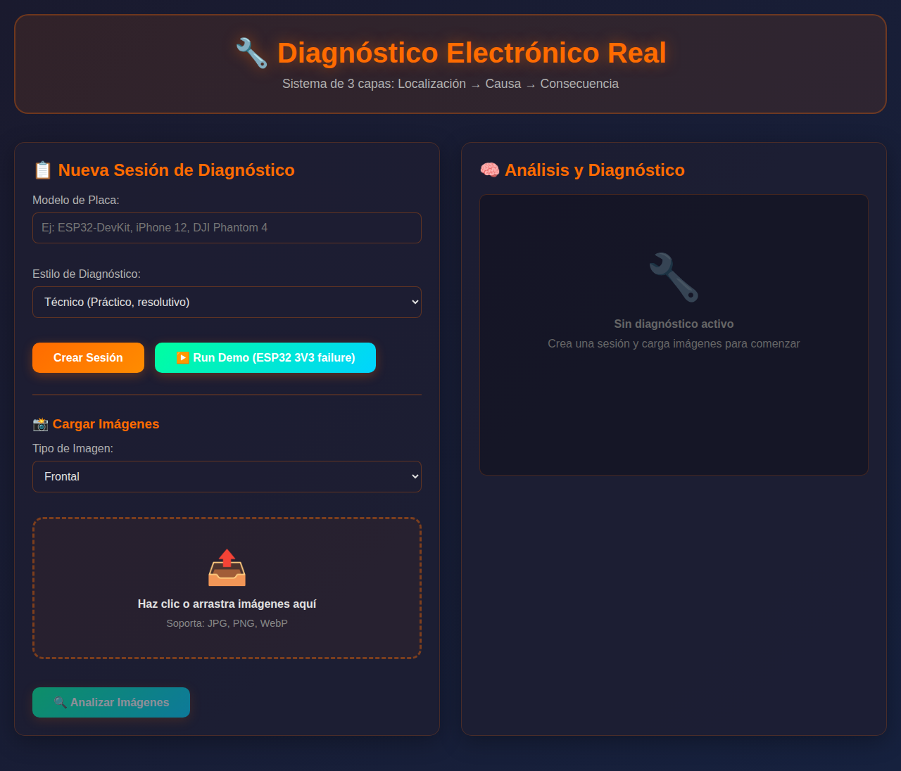

# 🎤 Iyari-ear v1.0

> **"Para que nadie quede fuera de la conversación"**
> 
> *Un puente de empatía técnica*

**Subtítulos en tiempo real para conversaciones cara a cara.**  
**Sistema de diagnóstico electrónico real para reparación profesional.**

*Creado con cariño para una amiga. Compartido con amor para el mundo.*

[]()
[]()
[]()
[]()

📖 **[Leer el Manifiesto](./MANIFIESTO.md)** | 🎬 **[Crear tu Demo](./GUIA_DEMO.md)** | 🚀 **[Release Notes v1.0](./RELEASE_NOTES_v1.0.md)**

---

## 🎉 ¡Bienvenido a Iyari-ear v1.0!

**Esta es la primera coronación oficial del proyecto.**

Iyari-ear deja de ser "solo código" y se convierte en **obra con alma**.

### ¿Qué es Iyari-ear?

Un **puente de empatía técnica** que permite a dos personas entenderse sin repetir tres veces la misma frase.

- 🎤 **Subtítulos en tiempo real** para conversaciones cara a cara
- 🔧 **Diagnóstico electrónico real** con razonamiento causal
- 💝 **Diseñado con empatía**, no con métricas
- 🔒 **No graba, no guarda, no vigila** (por diseño)

### Los Tres Elementos de la Coronación

1. ✨ **El Manifiesto**: [MANIFIESTO.md](./MANIFIESTO.md) - Para quién existe, qué dolor repara, qué belleza crea
2. 🎬 **La Demo Pública**: [GUIA_DEMO.md](./GUIA_DEMO.md) - Cómo crear y compartir tu demo de 30 segundos
3. 🚀 **El Release Oficial**: [RELEASE_NOTES_v1.0.md](./RELEASE_NOTES_v1.0.md) - v1.0 "Para que nadie quede fuera de la conversación"

---

## ✨ Características Principales

### 🎤 Sistema de Subtítulos en Tiempo Real
- Transcripción en vivo para apoyo auditivo
- Soporte para español e inglés
- Modo PWA instalable
- Interfaz accesible y colorida

### 🔧 Sistema de Diagnóstico Electrónico (NUEVO)
- **3 Capas de Diagnóstico**: Localización → Causa → Consecuencia
- **Estilos de diagnóstico**: Técnico, Ingeniero, Forense
- **Multi-shot**: Soporte para múltiples fotos por sesión
- **Modo asíncrono**: "Foto → Procesa → Diagnóstico"
- **Reportes completos**: Evidencia + diagnóstico + próximos pasos
- **Sistema Rail-first**: Análisis de voltajes y topología

---

## 🚀 Instalación Rápida

### Opción 1: PWA (Recomendado) - Funciona en todos los dispositivos

```bash
# 1. Inicia el servidor
pip install -r requirements.txt
python main.py

# 2. Abre Chrome/Edge en: http://localhost:8000
# 3. Click en "Instalar" (ícono ➕ en la barra de direcciones)
# 4. ¡Listo! Ahora tienes Iyari-ear como app
```

### Opción 2: CLI (Para usuarios técnicos)

```bash
# Instalar
pip install -e .

# Comandos disponibles
iyari-ear doctor      # Verifica sistema
iyari-ear test-mic    # Prueba micrófono
iyari-ear start       # Inicia servidor
```

### Opción 3: Ver guías específicas por plataforma

- **Windows**: [Ejecutable .exe](docs/PLATFORMS.md#-windows)
- **Linux**: [Script de instalación](docs/PLATFORMS.md#-linux)
- **Android (Termux)**: [Guía de instalación](docs/PLATFORMS.md#-android)
- **macOS**: [Homebrew setup](docs/PLATFORMS.md#-macos)

📖 **[Guía completa de instalación](docs/INSTALLATION.md)** | **[Matriz de compatibilidad](docs/PLATFORMS.md)**

---

<div align="center">

## 📱 Visualización de la Aplicación

<!-- TODO: Reemplazar esta imagen placeholder con una foto real -->
<!-- Ver PASO_3_GUIA_IMAGEN.md para instrucciones de cómo generar la imagen -->
<!-- Debe mostrar: Un celular sobre la mesa con subtítulos en pantalla -->


*Subtítulos en tiempo real en tu celular. Sin fricción. Solo conexión.*

</div>

---

<div align="center">

```text
📱 Un celular sobre la mesa
🗣️ Alguien habla
✨ Las palabras aparecen

Sin ruido. Sin fricción. Solo conexión.
```

</div>

---

## Pruébalo en 60 segundos ⚡

```bash
# Método 1: CLI (si ya lo instalaste)
iyari-ear start

# Método 2: Python directo
pip install -r requirements.txt
python main.py

# Acceder a las aplicaciones:
# - Subtítulos: http://localhost:8000
# - Diagnóstico Electrónico: http://localhost:8000/diagnostic
# - Optimizador de Subtítulos: http://localhost:8000/subtitle-optimizer
```

**💡 Nuevo:** Instala como PWA para acceso rápido desde tu menú de apps

---

## 🔧 Sistema de Diagnóstico Electrónico Real

### ¿Qué es esto?

Un sistema profesional de diagnóstico de placas electrónicas que piensa como un técnico de verdad.

**No es solo reconocimiento visual** — es **razonamiento causal**.

### 📸 Interfaz del Sistema



*Dashboard profesional con modo oscuro, drag & drop, y análisis en tiempo real*

### El Flujo (Modo Asíncrono)

```
📸 Foto → Sueltas la placa → 🧠 App procesa → 📋 Diagnóstico completo
```

Este flujo te permite:
- ✔ Usar ambas manos para trabajar
- ✔ Usar soldador / aire caliente
- ✔ Tomar mediciones
- ✔ Comparar con otras placas
- ✔ Generar reportes profesionales

### Las 3 Capas de Diagnóstico

<table>
<tr>
<td width="33%">

#### 📍 Capa 1: Localización
**¿Dónde está la falla?**
- Topología de la placa
- Bloque funcional
- Rail de voltaje
- Componente específico

</td>
<td width="33%">

#### 🔍 Capa 2: Causa
**¿Por qué existe la falla?**
- Análisis de causa raíz
- Evidencia recopilada
- Razonamiento técnico
- Pruebas sugeridas

</td>
<td width="33%">

#### ⚡ Capa 3: Consecuencia
**¿Qué rompe funcionalmente?**
- Impacto en el sistema
- Funciones afectadas
- Efectos en cascada
- Nivel de criticidad

</td>
</tr>
</table>

### 🎭 Tres Estilos de Diagnóstico

| Estilo | Perfil | Ejemplo |
|--------|--------|---------|
| **🔧 Técnico** | Directo y práctico | "3V3 ausente → Regulador falló. Medir salida, revisar entrada 5V." |
| **⚙️ Ingeniero** | Causal y metodológico | "El rail 3V3 es generado por un LDO (AMS1117). Causas posibles: (1) Regulador dañado, (2) Entrada 5V insuficiente, (3) Caps en corto..." |
| **🔬 Forense** | Exhaustivo y detallado | "Análisis completo: VBUS → Fusible → 5V → U1 → 3V3. Escenarios ordenados por probabilidad: (1) Falla térmica 60%, (2) Corto downstream 25%..." |

📖 [Ver ejemplos completos de cada estilo](docs/DIAGNOSTIC_STYLES.md)

### ▶️ Demo Rápido

**Prueba el sistema sin hardware:**

1. Abre http://localhost:8000/diagnostic
2. Click en **"▶️ Run Demo (ESP32 3V3 failure)"**
3. Observa el análisis en tiempo real
4. Revisa el diagnóstico completo

⏱️ Tiempo: 60 segundos

### Ejemplo de Diagnóstico Real

```
📸 Foto de placa → App procesa

✔ Identificando rails...
✔ 3V3 encontrado
✔ USB 5V encontrado
✔ Región RF detectada
✔ Posible regulador AMS1117
✔ Hipótesis: 3V3 ausente

📋 RESULTADO:
  🎯 Capa 1: Rail 3V3, Regulador U1
  🔍 Capa 2: Sin voltaje - Regulador falló
  ⚡ Capa 3: CRÍTICO - Radio no enciende, placa no arranca
  
  🔧 Próximos pasos:
     • Medir voltaje en TP3
     • Verificar continuidad desde fuente
     • Revisar AMS1117
     
  📊 Puntos de prueba: TP3, TP_3V3, Salida U1
```

### Uso Rápido

```bash
# Accede a la interfaz
http://localhost:8000/diagnostic

# 1. Crear sesión → Ingresa modelo de placa
# 2. Seleccionar estilo (Técnico/Ingeniero/Forense)
# 3. Subir fotos (frontal, backside, microscope, etc.)
# 4. Presionar "Analizar"
# 5. Recibir diagnóstico en tiempo real
# 6. Exportar reporte (JSON/TXT)
```

### Características Avanzadas

- **Multi-shot**: Sube 3-5 fotos de diferentes ángulos
- **Sesiones persistentes**: Historial de diagnósticos
- **Comparación A/B**: Compara con "Golden Board"
- **Análisis Rail-first**: VCC → Regulación → MCU → IO
- **Modo Ticket**: Saca fotos → App procesa → Devuelve diagnóstico

### Casos de Uso

1. **Taller de reparación**: Diagnóstico rápido antes de cotizar
2. **Soporte remoto**: Cliente envía fotos → Tú das diagnóstico
3. **Documentación**: Genera reportes con evidencia
4. **Capacitación**: Aprende patrones de fallas comunes
5. **Auditoría**: Historial de reparaciones y decisiones

---

## ¿Qué es esto? 💡

### Sistema de Subtítulos

Una **aplicación multiplataforma** para generar subtítulos en tiempo real. Captura audio desde el micrófono del navegador, lo envía a un servidor backend que lo transcribe a texto, y muestra los subtítulos en la pantalla.

Es una herramienta pensada para ayudar a personas con dificultades auditivas en conversaciones cara a cara, usando un celular, tablet o computadora como pantalla de apoyo.

### ✨ Características Nuevas

- 📱 **PWA**: Instálala como app en cualquier dispositivo
- 🎨 **Dashboard Colorido**: Diseño profesional con modo oscuro y tema rainbow
- 🔊 **Animación Pulse**: Indicador visual cuando detecta voz
- ♿ **Accesibilidad**: Modo alto contraste, texto ultra legible
- 🖥️ **CLI Completo**: Comandos `doctor`, `test-mic`, `start`
- 🪟 **Ejecutable Windows**: Doble-click y listo
- 🤖 **Soporte Android**: Via Termux o PWA
- 🐧 **Servicio Linux**: systemd para auto-inicio
- 🎬 **Optimizador de Subtítulos**: Valida y optimiza archivos de subtítulos (SRT, VTT, ASS)
- 🎮 **Plugin VLC**: Integración con VLC Media Player para optimización automática
- 🌐 **API REST**: Endpoints para procesamiento de subtítulos vía HTTP

## Cómo funciona

La aplicación tiene dos partes principales:
1.  **Frontend**: Una página web (HTML, CSS, JavaScript) que se ejecuta en el navegador. Se encarga de pedir permiso para el micrófono, grabar el audio y enviarlo al backend. También recibe el texto transcrito y lo muestra.
2.  **Backend**: Un servidor en Python (FastAPI, WebSockets) que recibe los fragmentos de audio, utiliza la API de reconocimiento de voz de Google para transcribirlos a texto y los devuelve al frontend.

## Ejemplos de Uso Real 🌍

### Ejemplo 1: Conversación cara a cara

María tiene pérdida auditiva parcial. Está sentada con una amiga en una cafetería ruidosa.
Coloca su celular frente a la mesa y abre Iyari-ear.

La app muestra en tiempo real:

```
— ¿Quieres café o té?
— Café, por favor.
— ¿Azúcar?
— No, gracias.
```

María no necesita pedir que repitan. Lee y participa.

### Ejemplo 2: Consulta médica

Un paciente con dificultad auditiva asiste al doctor.

El doctor habla normalmente.
El celular del paciente muestra:

```
Doctor: Vamos a ajustar la dosis.
Doctor: ¿Has tenido mareos últimamente?
Paciente: No, solo un poco de cansancio.
```

No hay grabaciones.
No hay almacenamiento.
Solo texto en tiempo real.

### Ejemplo 3: Apoyo familiar

Una abuela con problemas auditivos usa una tablet durante la comida familiar.

La conversación aparece como subtítulos grandes y claros:

```
— El pastel es de chocolate.
— Cumples 8 años mañana.
— ¿Te gustó la escuela?
```

La tecnología desaparece.
Solo queda la conversación.

## Por qué existe esto ❤️

**"Creado con cariño para una amiga."**

Iyari-ear no es un producto. Es una herramienta de empatía.

- Ayudar a escuchar sin invadir.
- Apoyar sin vigilar.
- Mostrar palabras, no juzgar voces.

La tecnología al servicio de la conexión humana.

### Historia de Origen 📖

Este proyecto nació de ver a alguien que amas esforzarse para entender una conversación.

No de un análisis de mercado.  
No de una oportunidad de negocio.  
No de métricas o KPIs.

**Nació del deseo de que alguien especial no se quedara fuera de la conversación.**

En purépecha, **Iyari** significa "corazón" o "alma".  
Este proyecto tiene alma porque nació del corazón.

Cada línea de código fue escrita con una pregunta en mente:  
*"¿Esto ayuda a conectar o complica la vida?"*

Y esa pregunta sigue guiando cada decisión técnica.

Lee la historia completa en el **[Manifiesto](./MANIFIESTO.md)**.

## Flujo de la Aplicación 🔄

```
Micrófono del navegador
        ↓
Fragmentos de audio
        ↓
Servidor Python (WebSockets)
        ↓
API de reconocimiento de voz
        ↓
Texto transcrito
        ↓
Subtítulos en pantalla
```

Todo ocurre en segundos.

## Optimización de Subtítulos 🎬

Iyari-ear ahora incluye un potente sistema de optimización de subtítulos que mejora la legibilidad y compatibilidad de archivos de subtítulos.

### Características del Optimizador

- ✅ **Validación automática**: Detecta problemas de timing, superposiciones y formato
- 🔧 **Optimización inteligente**: Corrige duraciones, divide líneas largas, ajusta espaciado
- 📁 **Múltiples formatos**: Soporta SRT, VTT, ASS/SSA
- 🎮 **Plugin VLC**: Integración directa con VLC Media Player
- 🌐 **Interfaz web**: Interfaz drag-and-drop en el navegador
- 💻 **CLI potente**: Procesamiento por lotes desde línea de comandos
- 🔌 **API REST**: Integración con otros sistemas

### Uso Rápido

```bash
# Optimizar subtítulos desde CLI
iyari-ear process-subtitle pelicula.srt pelicula.optimized.srt

# Instalar plugin para VLC
iyari-ear install-vlc-plugin

# Acceder a interfaz web
# Visita: http://localhost:8000/subtitle-optimizer
```

### Documentación Completa

- 📖 [Guía de Optimización de Subtítulos](docs/SUBTITLE_OPTIMIZATION.md)
- 🎮 [Guía del Plugin VLC](docs/VLC_PLUGIN_GUIDE.md)

## Qué Iyari-ear NO es 🚫

- **No es una grabadora de audio**
- **No es un sistema de vigilancia**
- **No guarda conversaciones**
- **No reemplaza intérpretes de lengua de señas**
- **No es perfecto en ambientes extremadamente ruidosos**

Es una herramienta de apoyo, no de control.

## Limitaciones Conocidas ⚠️

- **Requiere conexión a internet**
- **La precisión depende del ruido ambiental**
- **Acentos muy marcados pueden afectar la transcripción**
- **No está pensada para transcripción legal o forense**

Estas limitaciones son parte del diseño ético del proyecto.

## Requisitos

- Python 3.7 o superior.
- Un micrófono conectado al dispositivo donde se abrirá la página web.
- Conexión a internet (ya que se usa la API de Google para la transcripción).

## Instrucciones de Instalación y Uso

Sigue estos pasos para poner en marcha la aplicación.

### 1. Preparar el Backend (El Servidor)

Primero, necesitamos instalar las dependencias de Python y ejecutar el servidor.

```bash
# 1. (Opcional pero recomendado) Crea un entorno virtual
python -m venv venv
source venv/bin/activate  # En Windows usa: venv\\Scripts\\activate

# 2. Instala las librerías necesarias desde requirements.txt
pip install -r requirements.txt

# 3. Inicia el servidor
python main.py
```

Si todo va bien, verás un mensaje como este en tu terminal, lo que significa que el servidor está escuchando:
`Servidor de WebSockets iniciado en ws://0.0.0.0:8000`

**Deja esta terminal abierta mientras usas la aplicación.**

### 2. Usar la Aplicación (El Frontend)

Ahora que el servidor está corriendo, puedes abrir la interfaz.

**Opción A: En la misma computadora**

1.  Abre el archivo `index.html` directamente en tu navegador web (Firefox, Chrome, etc.).
2.  La página se cargará. Presiona el botón "Iniciar".
3.  El navegador te pedirá permiso para usar el micrófono. Debes aceptarlo.
4.  ¡Habla y los subtítulos aparecerán en la pantalla!

**Opción B: En tu celular (o cualquier otro dispositivo)**

Esta es la forma más práctica de usarlo.

1.  Asegúrate de que tu celular y la computadora donde corre el servidor estén **conectados a la misma red Wi-Fi**.
2.  Busca la dirección IP local de tu computadora.
    - **En Windows:** Abre `cmd` y escribe `ipconfig`. Busca la dirección "IPv4 Address".
    - **En macOS o Linux:** Abre una terminal y escribe `hostname -I` o `ifconfig`.
    - Será un número como `192.168.1.10` o `10.0.0.5`.
3.  En el navegador de tu celular, introduce la siguiente dirección:
    `http://<LA_IP_DE_TU_COMPUTADORA>:8000`
    (Reemplaza `<LA_IP_DE_TU_COMPUTADORA>` con el número que encontraste).

4.  La página cargará. Presiona "Iniciar", acepta el permiso del micrófono y ¡listo! El servidor de Python se encarga de todo.

---

## Solución de Problemas

### Error al instalar `PyAudio` en Linux

Si durante la instalación (`pip install -r requirements.txt`) ves un error relacionado con `PyAudio` y `portaudio.h`, significa que te falta una librería del sistema.

Puedes solucionarlo instalando el paquete de desarrollo de PortAudio. En sistemas basados en Debian/Ubuntu, el comando es:

```bash
sudo apt-get update && sudo apt-get install -y portaudio19-dev
```

Después de instalarlo, vuelve a ejecutar `pip install -r requirements.txt`.

---

## 🎬 Comparte Tu Demo

**"El universo ama las demostraciones."**

Si Iyari-ear te ayuda (o a alguien que conoces), nos encantaría verlo en acción.

### Cómo Crear Tu Demo de 30 Segundos

1. 📱 Graba la app funcionando (con celular o cámara)
2. 🗣️ Muestra subtítulos apareciendo en tiempo real
3. ✂️ Edita a 30 segundos
4. 📤 Comparte en redes o GitHub

**Guía completa**: [GUIA_DEMO.md](./GUIA_DEMO.md)

### Dónde Compartir

- **GitHub**: Abre un Issue con tu demo/historia
- **Twitter/X**: Usa #IyariEar #Accesibilidad
- **LinkedIn**: Comparte tu caso de uso
- **YouTube**: Video completo con descripción

### Historias Reales

Usa la plantilla: [ISSUE_TEMPLATE_HISTORIAS_REALES.md](./ISSUE_TEMPLATE_HISTORIAS_REALES.md)

**No necesitamos métricas. Necesitamos historias humanas.**

---

## 🤝 Contribuir

Este proyecto vive de la comunidad.

### Formas de Contribuir

- 💻 **Código**: Mejoras, features, fixes
- 📖 **Documentación**: Traducciones, guías, ejemplos
- 🐛 **Reporte de bugs**: Con contexto y pasos para reproducir
- 💡 **Ideas**: Sugerencias que ayuden a conectar personas
- 🎬 **Demos**: Muestra la app en acción
- ❤️ **Historias**: Comparte cómo te ayudó

### Guías de Contribución

```bash
# Fork el repositorio
git clone https://github.com/TU_USUARIO/Iyari-ear.git

# Crea una rama
git checkout -b feature/mi-mejora

# Haz tus cambios, commit y push
git push origin feature/mi-mejora

# Abre un Pull Request
```

**Recuerda**: Cada decisión debe responder:  
*"¿Esto ayuda a conectar o complica la vida?"*

---

## 📜 Licencia

Este proyecto está diseñado para ser usado, modificado y compartido libremente.

**Única condición**: Mantén el espíritu de empatía y privacidad.

---

## 🌐 Enlaces Importantes

- 💝 **[Manifiesto](./MANIFIESTO.md)** - El alma del proyecto
- 🚀 **[Release v1.0](./RELEASE_NOTES_v1.0.md)** - Notas de la primera coronación
- 🎬 **[Guía de Demo](./GUIA_DEMO.md)** - Crea tu demo de 30 segundos
- ⚡ **[Inicio Rápido](./INICIO_RAPIDO.md)** - Empieza en 60 segundos
- 📖 **[Identidad del Repo](./GUIA_IDENTIDAD_REPO.md)** - Convenciones y estilo

---

<div align="center">

## 💝 La Coronación

**Iyari-ear v1.0 — "Para que nadie quede fuera de la conversación"**

*Un puente de empatía técnica*

**Creado con cariño para una amiga.**  
**Compartido con amor para el mundo.**

✨ Enero 2025 ✨

---

*"Este proyecto no necesita empujones. Necesita testigos."*

*"La mejor coronación es humana + mínima + real."*

---

⭐ Si este proyecto te ayuda, dale una estrella en GitHub  
🎬 Comparte tu demo  
❤️ Cuéntanos tu historia

</div>
